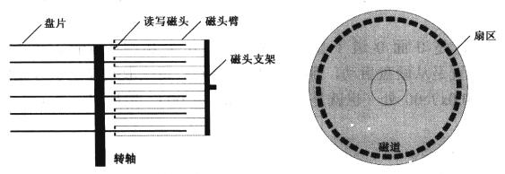
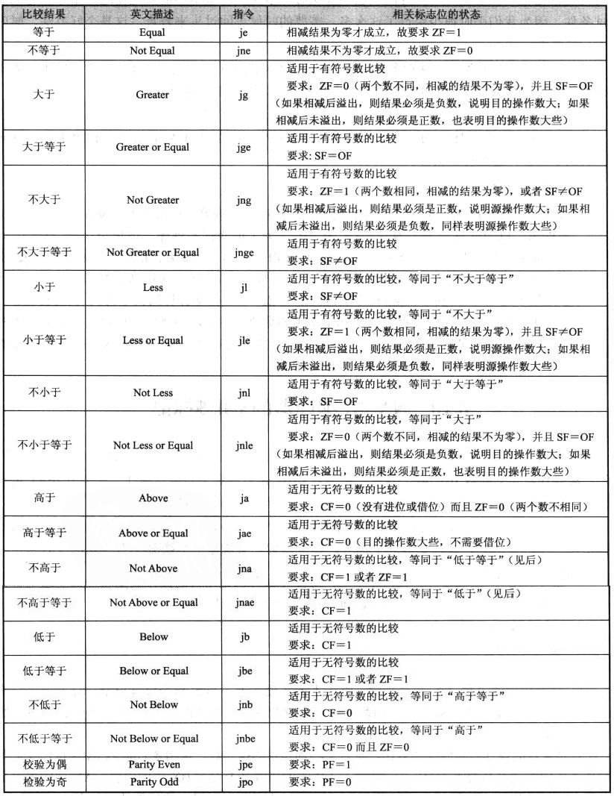

计算机是所有软件的基础，了解基础才能更好学习其他的内容，这里推荐一本书，李忠老师的《穿越计算机的迷雾》，它可以作为非计算机专业看的计算机原理书籍，也可以作为了解计算机发展的历史。这本书用通俗易懂的语言讲述了计算机从何而来，以及计算机最基本的原理。

再一本还是李忠老师的书，书名是《X86汇编语言-从实模式到保护模式》。它是一本讲计算机汇编语言的书籍，以NASM开源汇编器为编译工具。除了汇编语言以外，李忠老师详细讲解了实模式与保护模式，以及保护模式下的分段机制，分页机制，任务等CPU功能，这些内容的讲述为学习操作系统原理可以打下良好的基础。

这两本书都属于通俗易懂的书籍，非常推荐对计算机基础原理感兴趣而又不知从何处开始学习的人阅读。
<!-- more -->
这里将学习《X86汇编语言》中的一些心得做个简单记录，对这本书有兴趣的建议阅读全书。

#### 磁盘相关 ####

关于BIOS的内容以及BIOS加载引导扇区的内容不在这里记录了，之前记录了很多相关内容了。BIOS最后会将MBR，即引导设备的第一个扇区加载到0x7C00地址处，然后跳转到MBR继续执行。所以后面编程内容基本是从内存0x7C00处的MBR开始和开展。

磁盘作为计算机不可或缺的设备之一，之前对于磁盘的理解总不够深刻，通过本书有了比较深入的理解。如下图为一般的磁盘设备的结构。



磁盘的几个相关概念分别是磁头，盘面，磁道，柱面，扇区。在磁盘读取数据时，首先选择磁头，然后找到要读的磁道，最后盘面转到相应的扇区后，读出数据。盘片是固定的，所以一个盘片需要两个磁头，磁头臂运动后可以将磁头对准不同的磁道，盘面和磁头其实是一一对应的；片面上每一圈为一条磁道，盘面上从外到里被划分为一条条磁道；每条磁道又被划分成若干段，每一段是一个扇区。如果有多个盘片，多个盘面的同一个位置的磁道就形成了一个圆柱，被称为一个柱面。这样就形成了一圈扇区形成一个磁道，上下多个磁道形成一个柱面，所有柱面则形成了整个磁盘。编码从最外层的柱面开始，编码为0柱面，按照磁头排序，0号磁头对应的盘面上的0号柱面的磁道就是最早访问的磁道，该磁道上的第一个开始写数据的扇区被编码为1扇区。即硬盘的0面0道1扇区就是硬盘的第一个扇区，也即主引导扇区。如果将磁盘作为引导设备，那么这个扇区的512字节将被加载到内存的0x0000:0x7C00位置上，BIOS执行完毕后就会跳转到这个地址上继续运行。

上面说的按照磁头，磁道和扇区访问磁盘的方法为CHS模式，这个方式不是很方便，后来引入了逻辑块地址（Logical Block Address，LBA）的概念，LBA模式是磁盘控制器在硬件一级提供的支持，效率很高，兼容性也好。LBA不考虑扇区的物理位置，而是将全部的扇区组织起来并统一编号，这个编号从逻辑0号扇区开始。如下是一个CHS模式和LBA模式扇区的对应关系。


所以CHS到LBA的一个对应关系如下，C为柱面号，H为磁头号或盘面号，S为扇区号。这里有一个S-1，因为CHS中S的编号从1开始而LBA的扇区号从0开始，所以要减去1。

```
	LBA = C x 磁头总数 x 每道扇区数 + H x 每道扇区数 + （S - 1）
```

作者在进行代码验证时使用VirtualBox和Bochs，硬盘用VHD虚拟硬盘。这个格式作者有详细介绍，可以参考书附件中所带的该磁盘格式的说明。我个人向用Bochs所生成的`*.img`格式，一方面可以直接用于调试，另外也不依赖作者的工具必须写到VHD格式磁盘中。有一些人可能不知道怎么搞Bochs默认的`*.img`，参考Bochs创建磁盘的说明，先img中写数据可以使用dd工具，在github上有对应的代码可以参考。

磁盘作为外设连接到I/O控制器上，一般机器上的PATA/SATA会有两个接口，主硬盘接口分配端口号为0x1F0~0x1F7，副盘的接口分配端口为0x170~0x177。以主盘端口为例，0x1F0为读取数据端口，0x1F1为错误寄存器端口，0x1F2为读取扇区数，0x1F3~0x1F6为LBA起始逻辑扇区号，0x1F7为状态端口。如下代码段给出读取磁盘的一个函数：

```
    ; 
    ; Read Main HardDisk
    ; CX     start section no.
    ; ES:DI  buffer address
    ;    
read_harddisk_0:
    ; Read Section Number
    push dx
    
    mov dx, 0x1F2      ; 端口保存 读取几个扇区 
    mov al, 0x01
    out dx, al
    
    ; Start Section No
    mov dx, 0x1F3      ; 0x1F3/0x1F4/0x1F5/0x1F6保存起始的逻辑扇区号 
    mov al, cl
    out dx, al    
    inc dx             ; 0x1F4
    mov al, ch
    out dx, al
    inc dx             ; 0x1F5
    xor ax, ax 
    out dx, al
    inc dx             ; 0x1F6
    mov al, 0xE0       ; 0x1F6端口 高四字节 1X1Y  X表示CHS(0)/LBA Y表示主(0)/副磁盘 
    out dx, al         ; 1110 - 0xE0 主磁盘 LBA方式读取 
       
    ; Read Command
    mov dx, 0x1F7
    mov al, 0x20       ; 0x1F7 端口 0x20 表示读取磁盘    
    out dx, al
 
    ; Test Ready   
    mov dx, 0x1F7
 .waits:
    in al, dx          ; 读取0x1F7，获取磁盘驱动器状态
    and al, 0x88
    cmp al, 0x08
    jnz .waits
    
    ; Read data
    mov dx, 0x1F0     ; 0x1F0 读端口，0x1F1 为错误寄存器，包含磁盘最后一次操作状态码
    mov cx, 256
 .readw:
    in ax, dx
    mov [ES:DI], ax
    add di, 2
    loop .readw
    
    pop dx
    
    ret        
```

#### 显示相关 ####

实模式下显示文字比较简单，在实模式下显示为`80x25`的屏幕，一屏显示2000个字符，每个字符占据两个字节，一个字节为字符的ASCII码，另外一个字节为字符的颜色。视频显示的内存被映射到0xB800～0xBFFFF这段物理内存中，要想在屏幕上显示字符，直接修改0xB800处的内存即可。


如图2所示为显存和显示器上字符的对应关系，以及字符颜色字节的各位的意义。图3为字符所能设置的所有颜色种类以及各颜色对应的值。


如图3所示，在显存中低字节为字符，高字节为字符颜色。要想从屏幕左上角依次显示字符，则按照word的形式依次填充缓存即可。

现在的显卡虽然发展变化，但是VGA标准支持以及光标控制支持一直保留至今，这主要是因为任何计算机启动前都需要使用字符形式显示。光标在屏幕上的位置保存在显卡内部两个光标寄存器中，每个寄存器8位，合起来形成16位的数值。

标准VGA文本模式是25行，每行80个字符。如果这个16位值为0，则表示屏幕上0行0列，如果值为80，则表示1行0列。每个字符使用两个字节存储在显存中，所以光标位置×2则是显存字符位置。

换行（0x0a），则是跳到当前行的下一行相同位置，将光标位置直接加上80即可；回车（0x0d），则是回到当前行的行首，即光标位置除以80，忽略余数，再乘以80即得光标位置。

获取和设置光标位置的函数如下代码块所示。

```
;
; bx save pos info
;
set_cursor_pos:
    push dx
    mov dx, 0x3d4   ; 重置光标位置
    mov al, 0x0e
    out dx, al
    mov dx, 0x3d5
    mov al, bh
    out dx, al
    mov dx, 0x3d4
    mov al, 0x0f
    out dx, al
    mov dx, 0x3d5
    mov al, bl
    out dx, al
    pop dx
    ret
;
; ax return pos info
;
get_cursor_pos:
    push dx
    mov dx, 0x3d4   ; 读取光标位置
    mov al, 0x0e
    out dx, al
    mov dx, 0x3d5
    in al, dx
    mov ah, al
    mov dx, 0x3d4
    mov al, 0x0f
    out dx, al
    mov dx, 0x3d5
    in al, dx
    pop dx
    ret
```

#### Bochs调试 ####

单步执行 s / step

继续执行 c / continue

物理地址断点 b / break

虚拟地址断点 vb /vbreak

显示寄存器 r

显示段寄存器 sreg

显示物理地址 xp   xp /nfb

反汇编  u /n 0xXXXXXXXX    n为反汇编条数; 0xXXXXXXXX为要反汇编的内存地址

单步跳过 n / next 跳过循环指令

查看信息 info  info eflags 查看标记寄存器内容

查看栈 print-stack

退出调试 q / quit


#### NASM汇编 ####

** 数据声明 **

db，dw，dd，dq 分别表示定义字节，字，双字，四字的数据，这些数据会在编译后占据真实的空间。如：

```
db 0x55, 0xaa       ; 引导扇区结尾标识定义

number db 0,0,0,0,0 ; 标号number引用变量，五个字节数据并初始化为0
```

times伪指令可以重复定义数据/指令若干次

```
times 20 mov ax, bx 	; 重复mov ax, bx语句20次

times 203 db 0          ; 保留203个为0的字节
```

** $$与$ **

$代表当前行地址，即当前行标号；而$$代表当前汇编节或段的起始汇编地址，所以 jmp $ 相当于跳转到当前行，即死循环等价于 `infi: jmp near infi`

** 相对跳转的计算 **

E8跳转中，其后的相对偏移值按照如下的方式计算：

```
相对偏移 = 目标地址 - 跳转指令地址 - 跳转指令长度
```

** 变址寻址 **

在X86实模式下，变址寻址只能使用BX，SI，DI，BP四个寄存器

** 段格式 **

典型的段定义如下所示，header为段名称，align则是指定段的对齐字节，vstart=0则是指定本段内的汇编地址从本段起始位置开始计算，而非文件开头计算。

```
SECTION header align=16 vstart=0
```

vstart=0x7C00，编译后，本段内的地址引用以0x7C00做基地址计算。

在程序中可以使用 section.header.start来当作header段在文件中的偏移值。

** 用户程序 **

用户程序的加载，要有程序信息，在文件最开始位置保存程序信息。

```
程序的总长度
入口点
段重定位表项数
段重定位表
```

入口点用一个dw类型偏移，和一个dd类型基地址组成入口点，在重定位时将基地址计算为段地址。

而对于其他的段，则使用dd保存段在编译文件内的偏移，重定位时加上加载基地址，然后计算出段地址。而段内的使用的量不需修改，它们都是基于段起始地址的偏移，只要设置段寄存器，其后的数据都是正确的了。

** equ **

`app_lba_start equ 100`，equ设置量相当于C语言的#define，并不占据编译后文件空间，只是数值代表。

** 32位加法 **

在实模式下为16位，要做32位加法比较困难。可以使用DX:AX表示32位数字，而在做加法时，可以先将AX加上低16位数（add指令），然后将DX加上高16位数（adc指令）。adc指令是带进位的加法指令，即DX加加数高16位，同时加上进位CF。

** resb **

`resb 256`预留256字节空间，不初始化。同类指令还有resw，resd等

#### 中断 ####

中断按照来源可以分为外部硬件中断和内部软中断。硬件中断通过NMI和INTR来进行通知，NMI为非可屏蔽中断，INTR为可屏蔽中断。一般的PC使用8259芯片来负责外部硬件中断，8259芯片是可编程中断控制器（PIC），8259可以设置使用的中断号，内部存在IMR（中断屏蔽寄存器）用来开启或屏蔽对应的中断信息。CPU中EFLAGS的IF位用于屏蔽可屏蔽的中断，可以使用（sti和cli指令）指令进行开中断和关中断。

8259芯片的主片端口号为0x20和0x21，从片的端口号是0xa0和0xa1，通过这些端口访问芯片设置工作方式和IMR的内容。

实模式下的中断入口位于物理地址最低的1K内存范围内，即所谓的中断向量表IVT。IVT中每一项是4个字节，两个字节为段寄存器，另外两个字节为偏移。

#### 汇编指令 ####

**mov**： 数据传送指令，要求两个操作不能全是内存，其他没要求，移动数据大小用byte，word，dword，qword等来标注。

**jmp**: 跳转指令，近跳转，直接近跳转和间接近跳转，直接远跳转，间接远跳转

近跳转： jmp 偏移值
远跳转： jmp 段寄存器:偏移值

**call**: 调用指令，直接近调用，间接近调用，直接远调用和间接远调用

近跳转： jmp 偏移值
远跳转： jmp 段寄存器:偏移值

**add**：加法指令，adc带进位的加法指令

**div**：无符号数除法，idiv有符号数除法

16位除8位数：AX除一个数，AH保存余数，AL保存除结果
32位除16位数：DX:AX保存被除数，DX保存余数，AX保存除结果

**xor**：异或指令，相同为0，不同为1

**movsb**: movsw，以DS:SI作为源串，ES:DI作为目的地址，传送的字节或字有CX指定。EFLAGS方向位DF指定SI/DI的增长方向。cld将DF清零，以指示正方向，即从低地址到高地址，如`rep movsb`。

**inc**: dec 将操作数加1（减1）

**cld**: std 清除EFLAGS中的方向位，

**neg**: 用0减去操作数，即补码计算

**cbw**: cwd，cbw将AL扩展成为AX，cwd将AX扩展为DX:AX

**sub**: 减法指令，sbb带进位的减法指令

**jcxz**: jump if CX is zero，CX寄存器内容为0时则转移。

**cmp**: 等同于sub指令，不保存结果，只影响标记值，然后使用jcc指令族的指令进行转移。如下是cmp指令后可用的jcc指令族指令



**loop**: `loop digit`，两个操作，将CX值减一，CX不为0则跳转到digit，否则执行后续指令

**jcc**: 一个指令族，根据某些条件进行转移。除了cmp中的指令，还有js，jo，jc，jp分别对应于符号标记，溢出标记，进位标志，奇偶标志置位则跳转，jns，jno，jnc，jnp意义则s相反。

**and**: or  and是按位与操作，or是按位或操作

**push**: pop 压栈/出栈

**in**: out 用于I/O端口操作指令，读取I/O寄存器内容

**shl/shr**: 左移位/右移位，rol/ror循环左移和循环右移

**ret**: 函数/过程调用返回，iret中断函数返回，retf远调用返回

By Andy @2018-01-12 11:20:38
