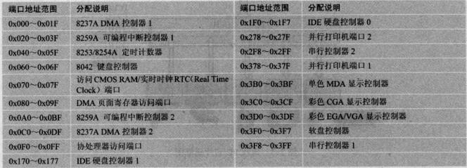

《Linux内核完全剖析-基于0.12内核》一书详尽地解析了Linux 0.12版本的内核源码，并且在书的最后一章给出了调试源代码的方法和在不同平台上编译的修改等。阅读一下该书，并作一些理解上的笔记，以备之后查阅。

#### Linux 0.12版本不足 ####

1. 没有调试代码（ptrace）- 0.95版本支持
2. 专门进程等待队列 -
3. TCP/IP网络代码 - 0.96版本支持
4. 内存管理与现有Linux内核不同 - 0.99版本支持
5. ext2/ext3等文件系统 - 0.97版本支持
6. 虚拟文件系统 - 0.95版本支持
7. 登录功能 - 0.95版本支持

#### PC中的控制器和控制卡 ####

在现代的PC中除了CPU之外，重要的硬件设施还有内存和外设。最早PC结构中有总线，内存和外设挂接在总线上；后期由于内存，视频等高速设备与外设的速率不同会造成问题，使用用两个速度不同的芯片来专门处理两类设备，即南北桥芯片；再到后面又将南北桥芯片融合成为一个。虽然总线接口等发生了很大变化，对于编程人员来说仍然与传统PC结构兼容。如下总结一下各个外设与芯片。

**独立编址I/O端口地址分配**

I/O端口地址编址方法有两种，一种是统一编址，另外一种是独立编制。Linux0.12上使用独立编制的I/O方式。如下为独立I/O编址中I/O端口地址分配情况：

**RTC（Real Time Chip）**

**中断控制器**

8259A可编程中断控制芯片或其兼容芯片，通过编程可以设置芯片的起始地址。

**DMA控制器**

Intel 8237芯片或其兼容芯片。在PC中具有两片8237共8个通道，在使用某个通道之前要首先进行初始化。设置芯片的端口有3个，分别是页面寄存器端口，（偏移）地址寄存器端口和数据计数寄存器端口个。

**定时/计数器**

Intel 8253/8254 可编程定时/计数器芯片，PIT（Programmable Interval Timer）。在PC/AT及兼容机中使用的是8254芯片，3个定时/计数器通道分别用于时钟计时中断信号，动态内存DRAM刷新定时电路和主机扬声器音调合成。Linux 0.12中使用通道0，将其设置为工作方式3，即每隔10ms发出一个信号以产生中断请求信号（IRQ0）。

**键盘控制器**

键盘控制器通常采用Intel 8042单片微处理器芯片或其兼容电路。

**串行控制卡**

**显示控制**

**软盘和硬盘控制器**

#### Linux 0.12内存管理 ####

最多64个进程，每个进程占据64M虚拟地址空间。

#### 推荐参考书籍 ####

1. 《The C Programming Language》 Brian W. Kernighan和Dennis M. Ritchie
2. 《Unix操作系统设计》 M. J. Bach
3. 《操作系统：设计与实现》 Andrew S. Tanenbaum
4. 《Programming the 80386》 John H. Crawford
5. 《Linux内核源码分析》 Scott Maxwell
6. 《莱昂氏UNIX源代码分析》 John Lions

#### Linux内核源码资源 ####

1. https://www.kernel.org   // Linux内核源码官网
2. http://oldlinux.org      // 赵炯博士老版本Linux源码资源网址
3. https://www.kernel.org/pub/linux/kernel/ // 现存所有版本内核源码

By Andy @2018-03-28 11:20:38
