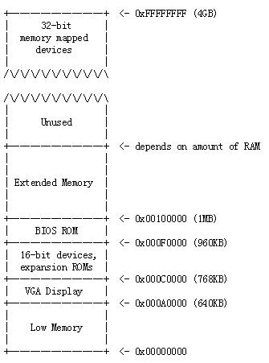
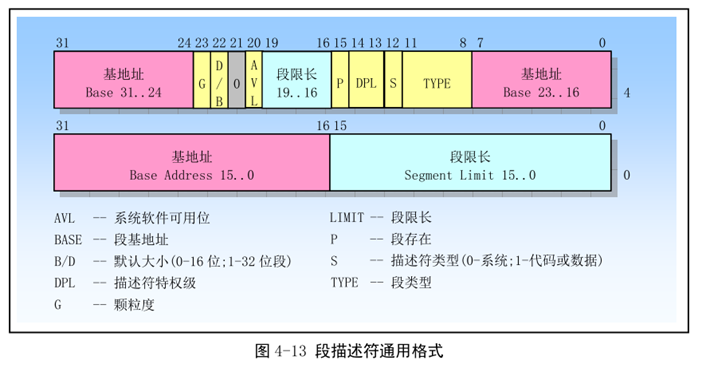
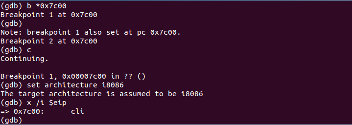

## 阅读 XV6 ##

#### XV6介绍 ####

回看这一年多的学习历程，其实是一个递归的过程，在学习中不断递归进入下一层，现在回到XV6的课程。在展开以及返回过程中，不求博客整洁，只需思路清晰，问题明了解释即可。这样可以节省不少力求博客完整性所需花费的大量思考时间（这个可以在所有完成之后，逐一整理），所以不明，不顺，不全之处请各位看官见谅。

XV6系统来自于MIT教学，专门用于操作系统课程的原理与代码结合讲解，并用于课程实践。XV6改编自V6操作系统，V6则无需多言，最初由Unix作者实现于PDP-11机器之上，且非ANSI C完成。MIT师生为了教学方便，将原版V6系统在Intel X86平台上用ANSI C重新实现，即XV6。

MIT最新的教学主页，[https://pdos.csail.mit.edu/6.828/2017/xv6.html](https://pdos.csail.mit.edu/6.828/2017/xv6.html)。XV6教程中文翻译版本，北京大学等几个同学完成，Github地址[https://github.com/ranxian/xv6-chinese](https://github.com/ranxian/xv6-chinese)。

笔记一般分为两个方面，正式的内容，包括XV6原理阅读，代码分析等；XV6存在问题部分则说明了与流行操作系统相比所存在的差别，也作为进一步细化的方向。当然了这些仅是阅读中所了解以及个人的一些想法，可能存在不实地方。

XV6涉及了操作系统中主要的几个方面，包括系统调用，进程，内存管理，I/O，文件系统，管道等，除了这些与用户紧密相关的几个方面之外还包括物理内存管理，中断，驱动程序，同步机制（锁），进程调度等。在下面小节中依次进行学习与笔记记录，包括如下小节：

* 编译工具部署与调试环境建立
* XV6引导进入内核模块过程
* XV6的内存管理
* XV6的中断，异常，系统调用以及驱动程序
* XV6的同步机制与锁
* XV6的进程调度
* XV6的文件系统
* XV6的第一个进程，以及进程创建
* 多核CPU处理
* IOAPIC/串口/控制台/硬盘

** XV6系统存在问题 **

* 没有用户概念，即所有程序都以root用户执行。

By Andy @2017-12-17 12:41:23


#### 编译工具部署与调试环境建立 ####

引用一句古话，“工欲善其事，必先利其器”。在开始学习之前先要将必要的环境搭建起来，以方便学习过程中的编译，调试，以及问题解决。

在后面使用到两组工具，一个是X86模拟器（Qemu）用来运行内核；另外一个就是编译器工具链，包括汇编器、链接器、C编译器和调试器，它们用来编译和连接内核。对于非MIT的学生就没有办法使用他们的环境了，那么需要自己按照自己的系统平台进行设置。

**编译工具链**

* 使用`objdump -i`命令检查是否安装了工具链（输出`elf32-i386`）
* 使用`gcc -m32 -print-libgcc-file-name`检查是否具有gcc的lib库（输出类似`/usr/lib/gcc/i486-linuxgnu/version/libgcc.a`的字符串，version表示gnu的版本）

输出正常，说明已经具备了基本的环境，否则可以通过安装程序进行安装，如Ubuntu上可以使用`sudo apt-get install -y build-essential gdb`命令安装。如果是X64的系统，则还需要安装32位的支持库，如`sudo apt-get install gcc-multilib`安装32位的支持库。

**Qemu虚拟机**

在Shell中执行`qemu`查看可以安装的qemu虚拟机。如果没有安装，通过命令`sudo apt-get install qemu-system-x86`进行安装。安装完成后，在Shell中输入`qemu-system-i386`就可以看到Qemu虚拟机执行起来了。为了方便使用，执行`sudo ln -s /usr/bin/qemu-system-i386 /usr/bin/qemu`命令生成Qemu的符号链接，以后直接运行`qemu`即可。

** 工具使用与环境配置 **

Qemu中包含了一个gdbserver，可以使用gdb连接到gdbserver对Qemu中的内核进行调试。Qemu启动后等待gdb连接可以配置为如下的形式，其中`-s`选项表示Qemu在本机localhost:1234上等待gdb连接：

```
// 启动qemu，并且等待gdb连接
$> qemu-system-i386 -drive file=xv6.img,index=0,media=disk,format=raw -smp 1 -m 512 -s -S
// -drive 添加驱动器，后面是其参数
// -smp 表示对称多处理器，这里先设置为1
// -m 表示内存大小参数
// -s -gdb参数的缩写，表示 -gdb tcp:1234
// -S 表示启动后CPU暂时冻结
```

在gdb中可以通过如下命令连接到Qemu模拟器上：

```
gdb> target remote localhost:1234     // 使用TCP进行远程调试，端口为1234

gdb> set architecture i8086           // 切换到调试16位代码
gdb> set architecture i386            // 切换到调试32位代码
```

这样就可以使用gdb调试模拟器中的操作系统了，使用gdb的通用命令，对于gdb比较熟悉的人非常有利。

Qemu的`-d`参数可以生成中断的详细日志。对于调试虚拟内存问题，尝试使用Qemu监视器的`info mem`命令和`info pg`命令获取更多关于虚拟内存的信息。调试多CPU，可以使用GDB的线程相关命令如`thread`和`info threads`等。

GDB中调试用户程序，使用`symbol-file`命令指定符号表。可以使用.gdbinit文件配置内核符号表文件（`obj/kern/kernel`）。用户环境中的符号表在ELF二进制文件中，可以使用 `symbol-file obj/user/name`指定符号表。不要从`.o`文件中加载符号，这些文件中的符号还没有经过链接器的重定位，它们的值可能不正确。

由于GDB在一开始就挂接到虚拟机了，它可以看到时钟中断（时钟中断就像控制转移一样）。这使得GDB无法单步进入用户代码。`stepi`命令可以正常工作，因为它会屏蔽中断，但是它仅仅前进一条汇编指令。断点也可以，但是要小心在不同环境中命中了相同的EIP。

GDB常用命令：

```
Ctrl-c		// 停止虚拟机运行，断到GDB中。多核的情况，所有CPU被中段。

c/continue	// 继续执行，直到遇到断点或Ctrl-c

si/stepi 	// 执行一条机器指令

b function/b file:line / breakpoint
	// 在给定的函数或行上设置断点

b *addr/breakpoint *addr
	// 在地址addr上设置断点

set print pretty
	// 开启规整打印数组或结构体

info registers
	// 打印通用寄存器，eip，eflags以及段寄存器

x /Nx addr  // 在虚拟地址addr处显示N个字的16进制输出。N省略，则显示一个字。addr可以是任何表达式

x /Ni addr  // 显示地址addr开始的N条汇编指令，使用$eip作为addr参数，会输出当前指令指针处的汇编指令

symbol-file file
	// 将当前的符号文件切换到file。在挂接到Qemu的调试中，没有进程边界的提示；所以我们必须GDB使用那个符号文件。默认情况下，配置GDB使用内核符号文件，即obj/kern/kernel。如果运行在用户代码中，比如hello.c，则需要使用`symbol-file obj/user/hello`命令切换到hello的符号。

//Qemu在GDB中将每一个虚拟CPU表示为一个线程，因此可以使用GDB线程相关的命令查看和操作Qemu的虚拟CPU。
thread n	// GDB切换到线程n。n从0开始计数

info threads// 显示所有的线程，包括它们的状态以及所在的函数代码
```

Qemu常用命令:

Qemu包含了一个内置的监视器，它可以查看和修改机器状态。可以从运行Qemu的终端中通过按`Ctrl-a c`切换到监视器中，再次按`Ctrl-a c`钱换回串口控制台。完整的文档信息可以参考Qemu手册。

```
xp /Nx paddr	// 在物理地址paddr处显示N个字的16进制输出。类似GDB的x命令

info registers	// 显示机器内部寄存器的完整输出。它会包含段选择子的隐藏部分，局部，全局寄存器和中断描述符表。

info mem		// 显示映射的虚拟内存以及内存权限许可

info pg			// 显示当前的页表结构，输出类似info mem

-d int			// Qemu运行时的选项，将所有中断写入日志qemu.log，带有完整的寄存器输出
```

By Andy @2018-04-14 16:28:12


#### XV6引导进入内核模块过程 ####

PC硬件就没有什么笔记可记录了，基于Intel X86 CPU，介绍它的文档很多，且官方也有参考文档。XV6课程信息中有一部分硬件相关的参考文档，页面地址为:[https://pdos.csail.mit.edu/6.828/2017/reference.html](https://pdos.csail.mit.edu/6.828/2017/reference.html)。

PC启动时，CPU加电后最初始状态并非正常运行时的保护模式，也非MSDOS所使用的实模式，而是一种中间状态，指示CPU运行的段寄存器CS和EIP值各有初始值。CS寄存器值为0xF000，其Base值为0xFFFF0000；EIP则为0x0000FFF0，即IP=0xFFF0。此时的CPU运行代码地址由Base+EIP来计算，即Base+EIP=0xFFFFFFF0。该地址向内容为一条跳转指令，JMP 0xF000:E05B，跳转的目标地址即BIOS在内存中的映射地址。一旦执行了JMP指令，则CPU的CS被重新置位，且CPU进入保护模式，之后的寻址按照CS:IP的形式完成。

在这时内存的布局如下图1所示。早期的Intel 8088处理器是16位，它仅仅能够访问1MB的物理内存，当时作为RAM的仅仅是其中低640KB被称为"Low Memory"一块内存。从0x000A0000开始的384KB的区域被保留给硬件作为特殊用途，比如视频显示缓存，固件。其中最重要的是占据0x000F0000~0x000FFFFF区域的BIOS，早先时候BIOS保存在ROM中，现在一般保存在Flash内存中。

在80286以及之后的CPU中已经打破了1MB的内存访问局限，它们支持16MB到4GB的物理内存访问。PC架构为了保持与老式的软件兼容，保留了物理地址空间低1MB的分布形式。由此现代的PC上RAM就被0x000A0000~0x00100000这个"洞"分割为两块，即Low Memory和extended memory。同时在32位物理地址空间的顶部一部分内存空间也被保留给32位的PIC设备使用。



BIOS首先进行PC硬件的检测与初始化工作，比如显卡激活，校验内存总大小等，然后BIOS加载用于引导的设备上的第一个扇区（即主引导扇区）到内存0x7C00地址处，并跳转到该地址继续执行。为什么是0x7C00，这个没什么原因。它本来可以是一个任意的地址，但是PC上就被定为了0x7C00，也就变成了固定和标准。

XV6的主引导扇区代码在`bootasm.S`和`bootasm.c`文件中，这两块代码分别为汇编和C代码，它们合起来即XV6的bootloader，这个bootloader编译后小到不超过512字节，被放到了主引导扇区中。

bootasm.S的代码如下，

```
# Start the first CPU: switch to 32-bit protected mode, jump into C.
# The BIOS loads this code from the first sector of the hard disk into
# memory at physical address 0x7c00 and starts executing in real mode
# with %cs=0 %ip=7c00.

.code16                       # Assemble for 16-bit mode 16位汇编
.globl start
start:
  cli                         # BIOS enabled interrupts; disable 关中断

  # Zero data segment registers DS, ES, and SS.
  xorw    %ax,%ax             # Set %ax to zero
  movw    %ax,%ds             # -> Data Segment
  movw    %ax,%es             # -> Extra Segment
  movw    %ax,%ss             # -> Stack Segment

  # Physical address line A20 is tied to zero so that the first PCs
  # with 2 MB would run software that assumed 1 MB.  Undo that. 开启A20地址线
seta20.1:
  inb     $0x64,%al               # Wait for not busy
  testb   $0x2,%al
  jnz     seta20.1

  movb    $0xd1,%al               # 0xd1 -> port 0x64 写命令，设置0x60端口
  outb    %al,$0x64

seta20.2:
  inb     $0x64,%al               # Wait for not busy
  testb   $0x2,%al
  jnz     seta20.2

  movb    $0xdf,%al               # 0xdf -> port 0x60 写数据，开启A20地址线
  outb    %al,$0x60

  # Switch from real to protected mode.  Use a bootstrap GDT that makes
  # virtual addresses map directly to physical addresses so that the
  # effective memory map doesn't change during the transition.
  # 加载GDTR寄存器，开启保护模式
  lgdt    gdtdesc
  movl    %cr0, %eax
  orl     $CR0_PE, %eax
  movl    %eax, %cr0

//PAGEBREAK!
  # Complete the transition to 32-bit protected mode by using a long jmp
  # to reload %cs and %eip.  The segment descriptors are set up with no
  # translation, so that the mapping is still the identity mapping.
  # 通过长跳转加载CS:EIP寄存器内容，完成到32位保护模式的转换
  ljmp    $(SEG_KCODE<<3), $start32 #

.code32  # Tell assembler to generate 32-bit code now.
start32:
  # Set up the protected-mode data segment registers
  # 在跳转完之后，其他段寄存器没更新，需要代码更新
  movw    $(SEG_KDATA<<3), %ax    # Our data segment selector
  movw    %ax, %ds                # -> DS: Data Segment
  movw    %ax, %es                # -> ES: Extra Segment
  movw    %ax, %ss                # -> SS: Stack Segment
  movw    $0, %ax                 # Zero segments not ready for use
  movw    %ax, %fs                # -> FS
  movw    %ax, %gs                # -> GS

  # Set up the stack pointer and call into C.
  # 设置栈，栈顶为start，即0x7C00，跳转到C语言中
  movl    $start, %esp
  call    bootmain

  # If bootmain returns (it shouldn't), trigger a Bochs
  # breakpoint if running under Bochs, then loop.
  # bootmain函数不应该返回，如果在Bochs中返回了就触发Bochs的断点，再进入循环
  movw    $0x8a00, %ax            # 0x8a00 -> port 0x8a00
  movw    %ax, %dx
  outw    %ax, %dx
  movw    $0x8ae0, %ax            # 0x8ae0 -> port 0x8a00
  outw    %ax, %dx
spin:
  jmp     spin

# Bootstrap GDT
.p2align 2                                # force 4 byte alignment
gdt:
  SEG_NULLASM                             # null seg
  SEG_ASM(STA_X|STA_R, 0x0, 0xffffffff)   # code seg
  SEG_ASM(STA_W, 0x0, 0xffffffff)         # data seg

gdtdesc:
  .word   (gdtdesc - gdt - 1)             # sizeof(gdt) - 1
  .long   gdt                             # address gdt
```

下面解释一下代码：

1. 第一条指令cli，关闭中断，在BIOS中开启了中断，而进入主引导扇区后，离开了BIOS，则不能再用BIOS的中断系统了，不合理也不安全。
2. 几个段寄存器在BIOS如何使用不定，值也不可预测，到这里全部清空，防止有错误值存在。
3. seta20*两段汇编用于开启A20地址线，为进入32位保护模式做准备，这里使用的是键盘控制器的功能，即I/O端口0x64，0x60。
4. 接下来`lgdt gdtdesc`用于加载GDT表。代码最后的gdt段即引导阶段的GDT表，可以看到它有两项，一项代码段，一项数据段，两个段的基地址都为0x0，段限则都为0xFFFFFFFF，即整个4G空间。简单说这相当于没有段限制了，将CPU的段基址简化为基本没有。
5. 取出CR0寄存器值，并将其PE位置位，即开启保护模式。
6. 开启保护模式后，需要将CPU指令寻址切换到32位的段寻址方式，无法直接操作CS/EIP寄存器，所以采取`ljmp $(SEG_KCODE<<3), $start32`指令跳转到紧接着的start32处，目的是切换代码寻址方式到32位保护模式的段寻址。
7. 代码段寄存器CS就位后，要将数据段的段寄存器DS/ES/SS设置为指向GDT表数据段条目，FS/GS目前不用被设置为0。
8. 设置系统栈，将start标号设置为栈底，即从0x7C00向下的内存为栈区域
9. 调用bootmain()，即C函数。尽量多地用C语言编写，加快编写速度；同时利于理解。

在不出现问题的情况下，调用bootmain()则不会返回。如果返回了，向0x8A00端口写入数据（专用于Bochs模拟器）将控制权转回模拟器。如果不是模拟器，则进入spin段，spin段是一个死循环，表示出现了错误，无其他代码可执行了。（完整的bootloader则需要输出错误信息，以提示用户出现了错误）

注意这个汇编文件中包括了两部分代码，16位代码和32位代码，分别为start块和start32块。两块在汇编中分别用.code16和.code32进行标识。



```
// The 0xC0 means the limit is in 4096-byte units
// and (for executable segments) 32-bit mode.
#define SEG_ASM(type,base,lim)                                  \
        .word (((lim) >> 12) & 0xffff), ((base) & 0xffff);      \
        .byte (((base) >> 16) & 0xff), (0x90 | (type)),         \
                (0xC0 | (((lim) >> 28) & 0xf)), (((base) >> 24) & 0xff)
```

根据GDT表项的宏定义可知，SEG_ASM默认了B/D位为1，G为1，即32位段且粒度为4K；`0x90|（type）`则默认定义了P位为1，S为1，DPL则为0，即权限级别0，段存在，且为代码或数据段。这几项默认定义基本上确定GDT表项几乎没什么限制可言了，大小4G空间，物理地址直接映射为线性地址。

S位确定该项表示段还是系统的门描述符，S为1表示是段（包括数据段和代码段）。当它为段时，Type的最高位（即11位）为0，则说明是数据段，否则为代码段。当表示代码段时，D/B为表示使用默认操作数大小，32位代码还是16位代码；当表示数据段时，D/B段表示使用SP寄存器还是ESP寄存器。

函数bootmain()在bootmain.c文件中，其代码如下代码块所示。

```
void bootmain(void)
{
  struct elfhdr *elf;
  struct proghdr *ph, *eph;
  void (*entry)(void);
  uchar* pa;

  elf = (struct elfhdr*)0x10000;  // scratch space

  // Read 1st page off disk
  readseg((uchar*)elf, 4096, 0);

  // Is this an ELF executable?
  if(elf->magic != ELF_MAGIC)
    return;  // let bootasm.S handle error

  // Load each program segment (ignores ph flags).
  ph = (struct proghdr*)((uchar*)elf + elf->phoff);
  eph = ph + elf->phnum;
  for(; ph < eph; ph++){	//>
    pa = (uchar*)ph->paddr;
    readseg(pa, ph->filesz, ph->off);
    if(ph->memsz > ph->filesz)
      stosb(pa + ph->filesz, 0, ph->memsz - ph->filesz);
  }

  // Call the entry point from the ELF header.
  // Does not return!
  entry = (void(*)(void))(elf->entry);
  entry();
}
```

这段代码涉及到两个事情，读取磁盘，解析ELF格式文件；并且这段代码也有几个预定义。首先设置elf文件读取到内存的位置为0x10000，这个地址在应用程序编程中为程序的默认加载地址，即内核elf文件的默认加载地址；读取4K字节数据（肯定能将内核ELF文件的头读入进来），解析ELF头，确定读取数据是否ELF文件；依据ELF头格式依次从磁盘上读取ELF文件的各个段到内存中，这里要依照内核ELF文件中虚拟地址设置来将各段分别放到指定的内存位置；找到ELF文件的入口地址，并跳转过去继续执行。

在加载各个段时，这里有一个小的点要注意。段在文件中的大小和在内存中的大小并不一定相等，那么加载到内存后要将文件中段未覆盖的内存空间初始化为0。

```
// Read 'count' bytes at 'offset' from kernel into physical address 'pa'.
// Might copy more than asked.
// 从磁盘上offset位置加载count字节到pa指示的物理地址
void readseg(uchar* pa, uint count, uint offset)
{
  uchar* epa;
  epa = pa + count;
  // Round down to sector boundary. // 与扇区边界对齐，保证起始保存的位置和扇区大小对齐
  pa -= offset % SECTSIZE;
  // Translate from bytes to sectors; kernel starts at sector 1.
  // 起始字节转为起始扇区号，内核从扇区1开始
  offset = (offset / SECTSIZE) + 1;
  // If this is too slow, we could read lots of sectors at a time.
  // We'd write more to memory than asked, but it doesn't matter --
  // we load in increasing order.
  for(; pa < epa; pa += SECTSIZE, offset++) // >
    readsect(pa, offset);
}

// Read a single sector at offset into dst.
void readsect(void *dst, uint offset)
{
  // Issue command. LBA模式读取磁盘
  waitdisk();

  outb(0x1F2, 1);   // count = 1
  outb(0x1F3, offset);
  outb(0x1F4, offset >> 8);
  outb(0x1F5, offset >> 16);
  outb(0x1F6, (offset >> 24) | 0xE0);
  outb(0x1F7, 0x20);  // cmd 0x20 - read sectors

  // Read data.
  waitdisk();
  insl(0x1F0, dst, SECTSIZE/4);
}

void waitdisk(void)
{
  // Wait for disk ready.
  while((inb(0x1F7) & 0xC0) != 0x40)
    ;
}
```

读取磁盘是通过直接磁盘控制端口来实现，LBA方式。0x1F2为读取磁盘扇区数量，0x1F3～0x1F6为读取扇区逻辑号，0x1F7为磁盘控制命令端口。详细的内容不再此处列出，有兴趣可以Google。读取磁盘时这里也有一个预定义，即从逻辑扇区号1开始读取，因为逻辑扇区号0为主引导扇区，前面BIOS已经读取完毕（注意CHS形式的表示方法，扇区号从1开始计数）。

其实这里读取磁盘也可以调用BIOS的INT 10号功能，具体的方法可以查阅资料，尝试实现，这里不再一一列举。

**调试引导扇区**

在实验一中就直接编译整个XV6并进行调试可能会有一些复杂，这里将`bootmain()`改造一下，只让它输出一串字符表示运行起来，并不加载内核的模块。这样可以用实验一中的方法尝试调试。

```
#define CRTPORT	0x3D4

static uint16_t *crt = (uint16_t)0x000B8000; // CGA memory

static void
putc(const int c) {
	int pos;

	outb(CRTPORT, 14);
	pos = inb(CRTPORT + 1) << 8;
	outb(CRTPORT, 15);
	pos |= inb(CRTPORT + 1);

	if (c == '\n') {
		pos += 80 - pos % 80;
	}
	else
	{
		crt[pos++] = (c & 0xff) | 0x0700;
	}

	outb(CRTPORT, 14);
	outb(CRTPORT + 1, pos >> 8);
	outb(CRTPORT, 15);
	outb(CRTPORT + 1, pos);
}

static void
puts(const char *str) {
	while(*str != '\0') {
		putc(*str);
		str++;
	}
}

void
bootmain(void)
{
    char outPut[] = "Hello IdleOS!!!\n";
	puts(outPut);
	while(1)
		;
}
```

重写一个Makefile文件，生成xv6.img，然后按照上述方法启动qemu，并启动gdb进入远程调试。在引导扇区加载地址`0x7C00`处设置断点，并从gdb中让系统运行起来即可走到断点处，如下图。



具体的代码可以参考github上XV6的阅读笔记中`https://github.com/dbglife/xv6-read/tree/master/codes/lab0`目录下的代码。

** XV6系统存在问题 **

* 暂无

#### XV6的内存管理 ####

在上面执行到bootmain()函数中时，它加载了磁盘上从第2个扇区开始的内核文件，将它加载到了`0x00010000`地址处。根据ELF文件格式查找其入口地址，并跳转过去继续执行。从ELF的编译上可以知道，它的入口为指定的`_start`函数，即`entry.S`中的`_start`标号。

根据现代计算机的设置，分页开启后，内核被映射到`0x80000000`以上的内存空间中。所以Kernel中实际的虚拟地址也设置为从`0x80010000`开始，但是目前内核被加载到`0x00010000`地址处，所以在编译上入口点上要做一点手脚，将入口地址`_start`设置为`0x00010000`，以方便在引导时可以直接获取并跳转过去执行。如下的`_start = V2P_WO(entry)`语句就是将入口地址设置为entry虚拟地址减去`0x80000000`，即`0x00010000`。这里在如下代码块中给出了宏定义，可以根据`V2P_WO(x)`的定义很明确地得到上述结论。

```
#define EXTMEM  0x100000            // Start of extended memory
#define PHYSTOP 0xE000000           // Top physical memory
#define DEVSPACE 0xFE000000         // Other devices are at high addresses

// Key addresses for address space layout (see kmap in vm.c for layout)
#define KERNBASE 0x80000000         // First kernel virtual address
#define KERNLINK (KERNBASE+EXTMEM)  // Address where kernel is linked

#define V2P(a) (((uint) (a)) - KERNBASE)
#define P2V(a) (((void *) (a)) + KERNBASE)

#define V2P_WO(x) ((x) - KERNBASE)    // same as V2P, but without casts
#define P2V_WO(x) ((x) + KERNBASE)    // same as P2V, but without casts
```

进入entry后，首先开启了CPU的PSE机制，将页面大小设置为4M。然后设置页表物理到CR3，并修改CR0中的PG位开启分页机制。一旦开启了分页，后面使用的地址就变成了虚拟地址了。首先将使用的栈更新掉，切换为高地址stack段；然后通过间接跳转转到`main()`函数继续执行。这里必须使用间接跳转，否则汇编器生成了PC相关的跳转指令，那么其实跳转到的目标是`main()`的物理地址，而非高地址空间中虚拟地址的`main()`函数。

```
# Multiboot header.  Data to direct multiboot loader.
.p2align 2
.text
.globl multiboot_header
multiboot_header:
  #define magic 0x1badb002
  #define flags 0
  .long magic
  .long flags
  .long (-magic-flags)

# By convention, the _start symbol specifies the ELF entry point.
# Since we haven't set up virtual memory yet, our entry point is
# the physical address of 'entry'.
# 按照惯例，_start 符号被指定为ELF的入口点。因为还没有设置好虚拟内存，那么入口点
# 必须是entry的物理地址
.globl _start
_start = V2P_WO(entry)

# Entering xv6 on boot processor, with paging off.
# 在引导处理器上进入XV6，但是分页机制处于关闭状态。
.globl entry
entry:
  # Turn on page size extension for 4Mbyte pages 开启页大小扩展，以使用4M页面
  movl    %cr4, %eax
  orl     $(CR4_PSE), %eax
  movl    %eax, %cr4
  # Set page directory 设置页目录
  movl    $(V2P_WO(entrypgdir)), %eax
  movl    %eax, %cr3
  # Turn on paging. 开启分页
  movl    %cr0, %eax
  orl     $(CR0_PG|CR0_WP), %eax
  movl    %eax, %cr0

  # Set up the stack pointer. 设置栈指针，切换到高地址空间
  movl $(stack + KSTACKSIZE), %esp

  # Jump to main(), and switch to executing at
  # high addresses. The indirect call is needed because
  # the assembler produces a PC-relative instruction
  # for a direct jump.
  # 跳转到main()函数，切换到执行在高地址空间。需要间接跳转
  # 因为汇编器会为直接跳转生成一个 PC相对指令
  mov $main, %eax
  jmp *%eax

.comm stack, KSTACKSIZE
```

函数`main()`的代码如下所示。从注释中可以看到引导处理器从main()函数开始执行C代码，那么意思是XV6支持多核处理器，只有用于系统引导的CPU才会执行到这里，而其他的CPU不走这个过程。

在main函数中的任务可以从代码注释中进行了解，不再一一列举。

```
// Bootstrap processor starts running C code here.
// Allocate a real stack and switch to it, first
// doing some setup required for memory allocator to work.
int main(void)
{
  kinit1(end, P2V(4*1024*1024)); // phys page allocator 物理内存分配器初始化，内核结束地址到4M之间内存
  kvmalloc();      // kernel page table 内核页表
  mpinit();        // detect other processors 检测其他的处理器是否存在
  lapicinit();     // interrupt controller 中断控制器设置
  seginit();       // segment descriptors 短描述符设置
  picinit();       // disable pic 关闭PIC
  ioapicinit();    // another interrupt controller 另外一个中断控制器
  consoleinit();   // console hardware 控制台硬件初始化
  uartinit();      // serial port 串口初始化
  pinit();         // process table 进程表初始化
  tvinit();        // trap vectors 陷阱向量初始化
  binit();         // buffer cache 缓存初始化
  fileinit();      // file table 文件表初始化
  ideinit();       // disk  磁盘初始化
  startothers();   // start other processors 启动其他的处理器
  kinit2(P2V(4*1024*1024), P2V(PHYSTOP)); // 必须在startothers()之后，4M到物理内存结束
  userinit();      // first user process 第一个用户进程启动
  mpmain();        // finish this processor's setup 完成当前CPU的设置，
}

// Common CPU setup code. 共同的CPU设置代码
static void mpmain(void)
{
  cprintf("cpu%d: starting %d\n", cpuid(), cpuid());
  idtinit();       // load idt register 加载IDT寄存器
  xchg(&(mycpu()->started), 1); // tell startothers() we're up 告诉startothersCPU启动了
  scheduler();     // start running processes 进入处理器调度
}
```

下面看这一节的主要内容：内存管理。

**物理内存管理**

xv6中物理内存是通过链表将所有空闲物理内存分页后链接起来，通过`kalloc()`和`kfree()`两个函数进行管理。从上面系统的初始化过程可以看到有两个函数负责对物理内存进行初始化，分别是`kinit1()`和`kinit2()`。两个函数的调用时机也不同。

`main()`函数中首先调用`kinit1()`将物理内存中内核模块的结束位置end到4MB物理地址这一块空闲的内存分配给物理页分配器使用，主要用于重新构造页表时分配物理内存。而`kinit2()`函数则是初始化4MB以后一直到物理内存结束这块物理内存到空闲链表，以备之后系统中使用。其代码如下所示。

```
struct run {
  struct run *next;
};

struct {
  struct spinlock lock;
  int use_lock;
  struct run *freelist;
} kmem;

// Initialization happens in two phases.
// 1. main() calls kinit1() while still using entrypgdir to place just
// the pages mapped by entrypgdir on free list.
// 2. main() calls kinit2() with the rest of the physical pages
// after installing a full page table that maps them on all cores.
void kinit1(void *vstart, void *vend)
{
  initlock(&kmem.lock, "kmem");
  kmem.use_lock = 0;
  freerange(vstart, vend);
}

void kinit2(void *vstart, void *vend)
{
  freerange(vstart, vend);
  kmem.use_lock = 1;
}

void freerange(void *vstart, void *vend)
{
  char *p;
  p = (char*)PGROUNDUP((uint)vstart);
  for(; p + PGSIZE <= (char*)vend; p += PGSIZE)	// >
    kfree(p);
}
```

从代码可以看到，`kinit1()`和`kinit2()`两个函数都调用了`freerange()`进行地址区间的内存初始化。这里`freerange()`本来用于将一段物理内存释放掉，这里复用了它的功能，用于物理内存块的初始化。它会进一步对每一页物理内存调用`kfree()`函数，将该页物理内存挂到kmem结构中的freelist成员上。在kinit1中初始化了内存分配使用的锁，但是在之后的内存分配调用中并没有使用锁，一方面是因为此时系统还没有初始化完成，单CPU运行并不需要锁；另外一方面是因为这时候锁机制还没有初始化，也不能使用锁。内存分配使用锁是在kinit2函数调用之后。

物理内存管理主要是通过`kmalloc()`和`kfree()`两个函数完成，其代码如下所示。

```
//PAGEBREAK: 21
// Free the page of physical memory pointed at by v,
// which normally should have been returned by a
// call to kalloc().  (The exception is when
// initializing the allocator; see kinit above.)
// 使用v指向的物理内存页，v通常是通过kalloc()函数分配。
void kfree(char *v)
{
  struct run *r;

  if((uint)v % PGSIZE || v < end || V2P(v) >= PHYSTOP)
    panic("kfree");

  // Fill with junk to catch dangling refs.将物理内存页覆盖垃圾数据
  memset(v, 1, PGSIZE);

  if(kmem.use_lock)			// 如果要使用锁，则要先申请锁
    acquire(&kmem.lock);
  r = (struct run*)v;
  r->next = kmem.freelist;	// 放回空闲列表
  kmem.freelist = r;
  if(kmem.use_lock)
    release(&kmem.lock);
}

// Allocate one 4096-byte page of physical memory.
// Returns a pointer that the kernel can use.
// Returns 0 if the memory cannot be allocated.
// 分配一个4096字节的物理内存页。返回一个内核使用的指针。
// 如果内存分配失败则返回0。
char* kalloc(void)
{
  struct run *r;

  if(kmem.use_lock)
    acquire(&kmem.lock);
  r = kmem.freelist;		// 从freelist分配一页内存
  if(r)
    kmem.freelist = r->next;
  if(kmem.use_lock)
    release(&kmem.lock);
  return (char*)r;
}
```

**建立地址空间**

前面使用的固定页表其实是一个页大小为4MB的模式，页目录中只有一项数据。页为4MB大小的模式不太适用于系统正常运行时的内存分配，所以使用`kvmalloc()`函数对内核页表重新进行设置。kvmalloc()其实调用`setupkvm()`函数进行内核页表的设置，如下代码所示。

```
// This table defines the kernel's mappings, which are present in
// every process's page table.
static struct kmap {
  void *virt;
  uint phys_start;
  uint phys_end;
  int perm;
} kmap[] = {
 { (void*)KERNBASE, 0,             EXTMEM,    PTE_W}, // I/O space
 { (void*)KERNLINK, V2P(KERNLINK), V2P(data), 0},     // kern text+rodata
 { (void*)data,     V2P(data),     PHYSTOP,   PTE_W}, // kern data+memory
 { (void*)DEVSPACE, DEVSPACE,      0,         PTE_W}, // more devices
};

// Set up kernel part of a page table.
pde_t* setupkvm(void)
{
  pde_t *pgdir;
  struct kmap *k;

  if((pgdir = (pde_t*)kalloc()) == 0)
    return 0;
  memset(pgdir, 0, PGSIZE);
  if (P2V(PHYSTOP) > (void*)DEVSPACE)
    panic("PHYSTOP too high");
  for(k = kmap; k < &kmap[NELEM(kmap)]; k++) //>
    if(mappages(pgdir, k->virt, k->phys_end - k->phys_start,
                (uint)k->phys_start, k->perm) < 0) {	// >
      freevm(pgdir);
      return 0;
    }
  return pgdir;
}

// Switch h/w page table register to the kernel-only page table,
// for when no process is running.
void switchkvm(void)
{
  lcr3(V2P(kpgdir));   // switch to the kernel page table
}

// Allocate one page table for the machine for the kernel address
// space for scheduler processes.
// 为调度进程分配内核地址空间的页表
void kvmalloc(void)
{
  kpgdir = setupkvm();
  switchkvm();
}
```

通过代码可以看到，`setupkvm()`函数首先申请页目录使用的物理内存页面，然后根据`kmap`数组中的基本内存分布对物理页进行映射。可以看到对于`data`到物理内存上限都被内核映射了，这么做的原因是通过内核地址空间中的内存操作可以直接操作物理内存，在写页表时不需要进行映射，方便后面代码编写；但是这也会造成问题，一方面页表会多占用物理内存，另一方面要将所有的物理内存都映射到内核空间，这也限制了系统可管理物理内存总量，最多不超过2GB。在设置完内核页表后，`setupkvm()`函数返回构建的页目录地址，调用`switchkvm()`函数将CR3内容切换到新的页目录上。

对于物理内存的映射是通过`mappages()`函数完成的，其代码如下代码块所示。`mappages()`函数将一块物理内存映射到va起始的虚拟地址块中，具体参考代码；`walkpgdir()`则主要完成页表遍历，获取页目录中对应页目录项内容，以确定页表是否存在，存在则直接返回对应的页目录项，如果不存在则根据参数分配一块物理内存当作页表。

```
// Return the address of the PTE in page table pgdir
// that corresponds to virtual address va.  If alloc!=0,
// create any required page table pages.
// 根据虚拟地址va返回页表pgdir中PTE的地址，如果alloc不为0，
// 如果需要则创建页表所需要的物理页。
static pte_t * walkpgdir(pde_t *pgdir, const void *va, int alloc)
{
  pde_t *pde;
  pte_t *pgtab;

  pde = &pgdir[PDX(va)];	// 获取PDE（页目录项），确定PDE是否存在，以获取对应页表
  if(*pde & PTE_P){
    pgtab = (pte_t*)P2V(PTE_ADDR(*pde));
  } else {
    if(!alloc || (pgtab = (pte_t*)kalloc()) == 0) // 如果要分配，则分配物理页
      return 0;
    // Make sure all those PTE_P bits are zero.
    memset(pgtab, 0, PGSIZE);
    // The permissions here are overly generous, but they can
    // be further restricted by the permissions in the page table
    // entries, if necessary.
    *pde = V2P(pgtab) | PTE_P | PTE_W | PTE_U;	// 将页表物理页填写到页目录项中
  }
  return &pgtab[PTX(va)];
}

// Create PTEs for virtual addresses starting at va that refer to
// physical addresses starting at pa. va and size might not
// be page-aligned.
// 从虚拟地址va开始为pa开始的物理地址创建PTE，va和大小size可能不是页对齐。
static int mappages(pde_t *pgdir, void *va, uint size, uint pa, int perm)
{
  char *a, *last;
  pte_t *pte;

  a = (char*)PGROUNDDOWN((uint)va); // 起始结束地址进行页对齐
  last = (char*)PGROUNDDOWN(((uint)va) + size - 1);
  for(;;){	// 每次4K大小的块进行PTE查找，设置内容
    if((pte = walkpgdir(pgdir, a, 1)) == 0) // 遍历全局页目录，查找PTE
      return -1;
    if(*pte & PTE_P)
      panic("remap");
    *pte = pa | perm | PTE_P;	// 设置PTE内容
    if(a == last)
      break;
    a += PGSIZE;
    pa += PGSIZE;
  }
  return 0;
}
```

用户地址空间的建立放到XV6第一个进程创建过程中在列举，它和进程创建过程关联比较紧密。

** XV6系统存在问题 **

* 物理内存默认为240MB，并没有对机器可用内存进行枚举
* 将物理内存全部映射到了内核地址空间，限制物理内存大小
* 内存换页没有实现
* Copy-On-Write的Fork机制没有实现
* 共享内存和惰性分配（延迟分配 Lazily-allocated page）
* 栈也无法自动扩展

#### XV6的中断，异常，系统调用以及驱动程序 ####

** XV6系统存在问题 **

* abc

#### XV6的同步机制与锁 ####

** XV6系统存在问题 **

* abc

#### XV6的进程调度 ####

** XV6系统存在问题 **


* abc


#### XV6的文件系统 ####

** XV6系统存在问题 **

* abc


#### XV6的第一个进程，以及进程创建 ####


** XV6系统存在问题 **

* abc

#### XV6中多CPU初始化与调度 ####

** XV6系统存在问题 **

* abc


